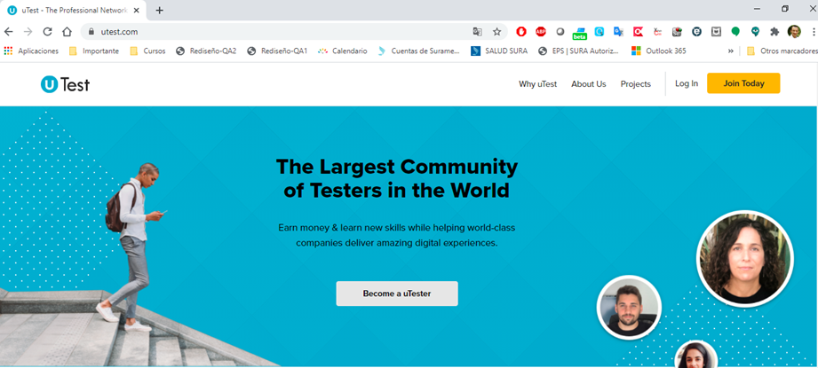

# retoUTestBancolombia

El proyecto contiene las siguientes caractaristicas:
- Contiene el patron de diseño Screenplay
- Se implemento el jdk 11.0.013 como version estable
- La mayor parte de las dependencias que estan en el bluid.gradle estan actualizadas
- Esta configurado para ejecutar en cualquier maquina y detectar el navegador y version para Chrome
- Se conecta remotamente para obtener el driveChrome, no contiene el driveChrome.exe
- Contiene  archivos llamados serenity.conf para dinamizar y serenity.properties para el uso de las propiedades tanto para chrome como serenity  

- **Se aplico una logica no comun de alto nivel y robusta de cierta manera, Un cifrado en base 64 a la Contraseña ya que son informacion sencibles y no debe estar expuesta, ya que no se integro con DB.**
- **IMPORTATE:** Todo el codigo del proyecto se le realizo analicis de codigo estatico con la herramienta SonarLink

Reto Técnico de Automatización

1.	Ingresar a la página de Utest.com y proceder a dar clic en la opción de registro (JOIN TODAY) y realizar el diligenciamiento del formulario con la finalidad de crear un nuevo usuario.

2.	Una vez realizada la automatización anterior, proceder a crear un repositorio en Azure o Git y cargar el código del ejercicio para luego compartir por correo electrónico dicho repositorio a: yarias@choucairtesting.com

Aspectos para evaluar:
-	Creación de la historia de usuario en español o inglés (No mezclar idiomas).
-	Aplicación del Patrón Screenplay.
-	Aplicación del modelo y estructura de proyecto.
-	Uso adecuado de la prioridad en la identificación de los objetos (locators)
*	Id
*	Name
*	Class
*	Xpath relativos

